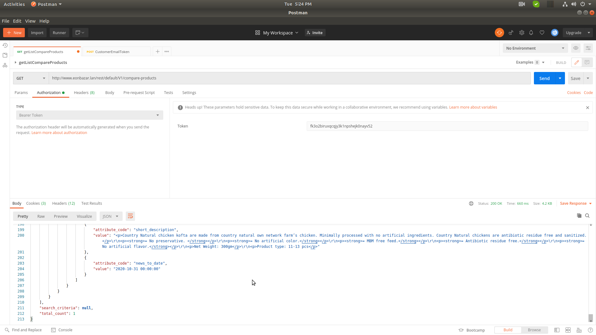

## Magento 2 EonInfosys_Compare

Magento 2 or Magento_Catalog Core Module no Compare  Api end-Point , this module added get Compare api end point

Methods: Get with customer login Bearer token

Url: http://www.eonbazar.lan/rest/default/V1/compare-products

### Developer

Thank you for watching guide.If you have any questions about this practice, please feel free to leave a comment or Please do not hesitate to contact me don't worry about charge I try to help  on my little knowledge, if you need me to join your Magento project especially extension development.

- Abdul Matin

- Skype/gmail/hangout:matinict

- Mobile/What-apps: +8801717676441

- Github: https://github.com/matinict

- Magento Developer Program Member & Community Contributors
